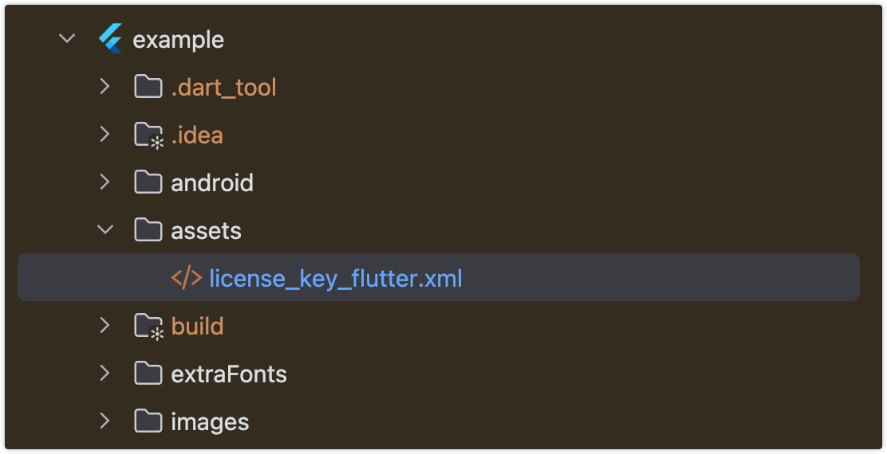
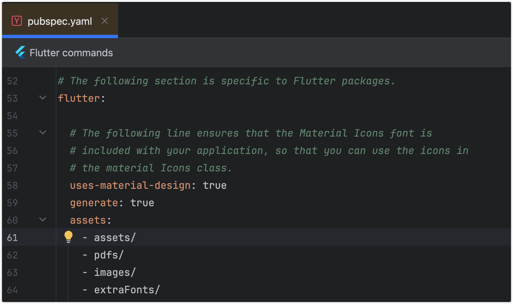

# ComPDFKit Flutter PDF Library

## About

[ComPDFKit for Flutter](https://www.compdf.com/guides/pdf-sdk/flutter/overview), developed and managed by [ComPDF](https://www.compdf.com/), is a powerful PDF library that enables developers to seamlessly integrate PDF viewing, a nnotation, editing, form filling, redaction, and signing into any iOS or Android application. It is available at [pub.dev](https://pub.dev/packages/compdfkit_flutter) and [GitHub.](https://github.com/ComPDFKit/compdfkit-pdf-sdk-flutter)

For more information, please check our [developer guides](https://www.compdf.com/guides/pdf-sdk/flutter/overview).

## Contents

* [Requirements](#requirements)
* [Steps to Build the Flutter PDF Editor by Integrating ComPDFKit PDF SDK](#steps-to-build-the-flutter-pdf-editor-by-integrating-compdfkit-pdf-sdk)
* [Example App](#example-app)
* [Support](#support)

## Requirements

Before starting, please make sure that you have already met the following prerequisites:

### Get ComPDFKit License Key

ComPDF offers two types of license keys: a free 30-day trial license and a commercial license.

- **Trial License** – You can request a [30-day free trial](https://www.compdf.com/pricing) online.  
- **Commercial License** – For advanced features, custom requirements, or quote inquiries, feel free to [contact our sales](https://www.compdf.com/contact-sales).  

For the Flutter PDF SDK, the commercial license must be bound to your application’s ApplicationId and iOS BundleId.


### System Requirements

**Android**

Please install the following required packages:

* The [latest stable version of Flutter](https://docs.flutter.dev/get-started/install)
* The [latest stable version of Android Studio](https://developer.android.com/studio)
* The [Android NDK](https://developer.android.com/studio/projects/install-ndk)
* An [Android Virtual Device](https://developer.android.com/studio/run/managing-avds.html)

Operating Environment Requirements:

* A minSdkVersion of `21` or higher.
* A `compileSdkVersion` of `34` or higher.
* A `targetSdkVersion` of `34` or higher.
* Android ABI(s): x86, x86_64, armeabi-v7a, arm64-v8a.

**iOS**

Please install the following required packages:

* The [latest stable version of Flutter](https://docs.flutter.dev/get-started/install)
* The [latest stable version of Xcode](https://apps.apple.com/us/app/xcode/id497799835?mt=12)
* The [latest stable version of CocoaPods](https://github.com/CocoaPods/CocoaPods/releases). Follow the [CocoaPods installation guide](https://guides.cocoapods.org/using/getting-started.html#installation) to install it.

Operating Environment Requirements:

* The iOS 12.0 or higher.
* The Xcode 12.0 or newer for Objective-C or Swift.

## How to Build the Flutter PDF Editor by Integrating ComPDFKit PDF SDK 

[](https://youtu.be/I0Rz11iVAbE)

### Create a new project

#### Android

1. Create a Flutter project called `example` with the `flutter` CLI:

```bash
flutter create --org com.compdfkit.flutter example
```

2. In the terminal app, change the location of the current working directory to your project:

```bash
cd example
```

3. open  `example/android/app/src/main/AndroidManifest.xml` , add `Internet Permission` and `Storage Permission`:

```diff
<manifest xmlns:android="http://schemas.android.com/apk/res/android"
    package="com.compdfkit.flutter.example">

+    <uses-permission android:name="android.permission.INTERNET"/>
  
    <!-- Required to read and write documents from device storage -->
+    <uses-permission android:name="android.permission.READ_EXTERNAL_STORAGE"/>
+    <uses-permission android:name="android.permission.WRITE_EXTERNAL_STORAGE"/>
  
    <!-- Optional settings -->
+    <uses-permission android:name="android.permission.MANAGE_EXTERNAL_STORAGE"/>


    <application
+      android:requestLegacyExternalStorage="true">
  
    </application>   
</manifest>
```

4. Open the app's Gradle build file, `android/app/build.gradle`:

```bash
open android/app/build.gradle
```

5. Modify the minimum SDK version, All this is done inside the `android` section:

```diff
 android {
     defaultConfig {
-        minSdkVersion flutter.minSdkVersion
+        minSdkVersion 21
         ...
     }
 }
```

6. Open the project’s main activity class, `android/app/src/main/java/com/example/compdfkit/flutter/example/MainActivity.java`, Change the base `Activity` to extend `FlutterFragmentActivity`:

```diff
- import io.flutter.embedding.android.FlutterActivity;
+ import io.flutter.embedding.android.FlutterFragmentActivity;

- public class MainActivity extends FlutterActivity {
+ public class MainActivity extends FlutterFragmentActivity {
}
```

Alternatively you can update the `AndroidManifest.xml` file to use `FlutterFragmentActivity` as the launcher activity:

```diff
<activity
-     android:name=".MainActivity" 
+     android:name="io.flutter.embedding.android.FlutterFragmentActivity"
      android:exported="true"
      android:hardwareAccelerated="true"
      android:launchMode="singleTop"
      android:theme="@style/LaunchTheme"
      android:windowSoftInputMode="adjustPan">
```

> **Note:** `FlutterFragmentActivity` is not an official part of the Flutter SDK. If you need to use `CPDFReaderWidget` in ComPDFKit for Flutter, you need to use this part of the code. You can skip this step if you don't need to use.

7. Add the ComPDFKit dependency in `pubspec.yaml`

```diff
 dependencies:
   flutter:
     sdk: flutter
+  compdfkit_flutter: ^2.4.7
```

8. Add the PDF documents you want to display in the project

* create a `pdf` directory

  ```bash
  mkdir pdfs
  ```
* Copy your example document into the newly created `pdfs` directory and name it `PDF_Document.pdf`

9. Specify the `assets` directory in `pubspec.yaml`

```diff
 flutter:
+  assets:
+    - pdfs/
```

10. From the terminal app, run the following command to get all the packages:

```bash
flutter pub get
```

#### iOS

1. Create a Flutter project called `example` with the `flutter` CLI:

```bash
flutter create --org com.compdfkit.flutter example
```

2. In the terminal app, change the location of the current working directory to your project:

```bash
cd example
```

3. Add the ComPDFKit dependency in `pubspec.yaml`

```diff
 dependencies:
   flutter:
     sdk: flutter
+  compdfkit_flutter: ^2.4.7
```

4. Open your project's Podfile in a text editor:

```bash
open ios/Podfile
```

**Note:** If SSL network requests fail to download the `ComPDFKit` library when you run `pod install`, you can see the processing method in [Troubleshooting](#Troubleshooting)).

6. Update the platform to iOS 12 and add the ComPDFKit Podspec:

```diff

- platform :ios, '9.0'
+ platform :ios, '12.0' 
 ...
 target 'Runner' do
   use_frameworks!
   use_modular_headers!`

   flutter_install_all_ios_pods File.dirname(File.realpath(__FILE__))
+  pod "ComPDFKit", podspec:'https://file.compdf.com/cocoapods/ios/compdfkit_pdf_sdk/2.4.7/ComPDFKit.podspec'
+  pod "ComPDFKit_Tools", podspec:'https://file.compdf.com/cocoapods/ios/compdfkit_pdf_sdk/2.4.7/ComPDFKit_Tools.podspec'
 end
```

7. Go to the `example/ios` folder and run the `pod install` command:

```bash
pod install
```

8. Add the PDF documents you want to display in the project

* create a `pdf` directory

  ```bash
  mkdir pdfs
  ```
* Copy your example document into the newly created `pdfs` directory and name it `PDF_Document.pdf`

9. Specify the `assets` directory in `pubspec.yaml`

```diff
 flutter:
+  assets:
+    - pdfs/
```

10. To protect user privacy, before accessing the sensitive privacy data, you need to find the "***Info\***" configuration in your iOS 10.0 or higher iOS project and configure the relevant privacy terms as shown in the following picture.


```objective-c
<key>NSCameraUsageDescription</key>
<string>Your consent is required before you could access the function.</string>

<key>NSMicrophoneUsageDescription</key>
<string>Your consent is required before you could access the function.</string>

<key>NSPhotoLibraryAddUsageDescription</key>
<string>Your consent is required before you could access the function.</string>

<key>NSPhotoLibraryUsageDescription</key>
<string>Your consent is required before you could access the function.</string>
  
<key>NSAppTransportSecurity</key>
	<dict>
		<key>NSAllowsArbitraryLoads</key>
		<true/>
	</dict>
```

11. From the terminal app, run the following command to get all the packages:

```bash
flutter pub get
```


### Apply the License Key

ComPDFKit PDF SDK currently supports two authentication methods to verify license keys: online authentication and offline authentication.

Learn about:

* [What is the authentication mechanism of ComPDFKit's license?](https://www.compdf.com/faq/authentication-mechanism-of-compdfkit-license)

* [What are the differences between Online Authentication and Offline Authentication?](https://www.compdf.com/faq/the-differences-between-online-authentication-and-offline-authentication)

Accurately obtaining the license key is crucial for the application of the license.

1. In the email you received, locate the `XML` file containing the license key.
2. Copy the License.xml file into the **assets directory** of your Flutter project.



3. Open the pubspec.yaml file of your project and configure the flutter: section to enable the assets directory.



4. Initialize the SDK:

```dart
// Include the license in Flutter assets and copy to device storage
// Add `license_key_flutter.xml` to your Flutter project’s assets directory;
File licenseFile = await CPDFFileUtil.extractAsset(context, 'assets/license_key_flutter.xml');
ComPDFKit.initWithPath(licenseFile.path);
```

**Alternative methods (optional)**

```dart
// Android
// Copy the license_key_flutter.xml file into the `android/app/src/main/assets` directory of your Android project:
ComPDFKit.initWithPath('assets://license_key_flutter.xml');

// iOS
// Copy the license_key_flutter.xml file into your iOS project directory (or a readable location):
ComPDFKit.initWithPath('license_key_flutter.xml');
```


### Run Project

There are 2 different ways to use ComPDFKit Flutter API:

* Present a document via a plugin.
* Show a ComPDFKit document view via a Widget.

#### Usage Plugin

Open `lib/main.dart`,replace the entire file with the following:

```dart
import 'dart:io';

import 'package:compdfkit_flutter/compdfkit.dart';
import 'package:compdfkit_flutter/configuration/cpdf_configuration.dart';
import 'package:compdfkit_flutter/util/cpdf_file_util.dart';
import 'package:flutter/material.dart';

const String _documentPath = 'pdfs/PDF_Document.pdf';

void main() {
  runApp(const MyApp());
}

class MyApp extends StatefulWidget {
  const MyApp({super.key});

  @override
  State<MyApp> createState() => _MyAppState();
}

class _MyAppState extends State<MyApp> {
  @override
  void initState() {
    super.initState();
    _init();
  }

  void _init() async {
    File licenseFile = await CPDFFileUtil.extractAsset(context, 'assets/license_key_flutter.xml');
    ComPDFKit.initWithPath(licenseFile.path);
  }

  @override
  Widget build(BuildContext context) {
    return MaterialApp(
      home: Scaffold(
        body: SafeArea(
          child: Center(
            child: ElevatedButton(
              onPressed: () async {
                showDocument(context);
              },
              child: const Text(
                'Open Document',
              )),
          ))),
    );
  }

  void showDocument(BuildContext context) async {
    var pdfFile = await CPDFFileUtil.extractAsset(_documentPath);
    var configuration = CPDFConfiguration();
    // Present a document via a plugin.
    ComPDFKit.openDocument(pdfFile.path,
                           password: '', configuration: configuration);
  }
}
```

#### Usage Widget

Open `lib/main.dart`,replace the entire file with the following:

```dart
import 'dart:io';

import 'package:compdfkit_flutter/compdfkit.dart';
import 'package:compdfkit_flutter/configuration/cpdf_configuration.dart';
import 'package:compdfkit_flutter/widgets/cpdf_reader_widget.dart';
import 'package:compdfkit_flutter/util/cpdf_file_util.dart';
import 'package:flutter/material.dart';

const String _documentPath = 'pdfs/PDF_Document.pdf';

void main() {
  runApp(const MyApp());
}

class MyApp extends StatefulWidget {
  const MyApp({super.key});

  @override
  State<MyApp> createState() => _MyAppState();
}

class _MyAppState extends State<MyApp> {
  String? _document;

  @override
  void initState() {
    super.initState();
    _init();
    _getDocumentPath().then((value) {
      setState(() {
        _document = value;
      });
    });
  }

  void _init() async {
    /// Please replace it with your ComPDFKit license
    File licenseFile = await CPDFFileUtil.extractAsset(context, 'assets/license_key_flutter.xml');
    ComPDFKit.initWithPath(licenseFile.path);
  }

  Future<String> _getDocumentPath() async {
    var file = await CPDFFileUtil.extractAsset('pdfs/PDF_Document.pdf');
    return file.path;
  }

  @override
  Widget build(BuildContext context) {
    return MaterialApp(
      home: Scaffold(
        resizeToAvoidBottomInset: false,
        appBar: AppBar(
          title: const Text('CPDFReaderWidget Example'),
        ),
        body: _document == null
        ? Container()
        : CPDFReaderWidget(
          document: _document!,
          configuration: CPDFConfiguration(),
          onCreated: (_create) => {})));
  }
}
```

Start your Android emulator, or connect a device, Run the app with:

```bash
flutter run
```

### Example APP

To see [ComPDFKit for Flutter](https://www.compdf.com/contact-sales) in action, check out our [Flutter example app](example/) and [API reference](https://pub.dev/documentation/compdfkit_flutter/latest/compdfkit/compdfkit-library.html)

Showing a PDF document inside your Flutter app is as simple as this:

```dart
/// First. Please replace it with your ComPDFKit license

// Include the license in Flutter assets and copy to device storage
// Add `license_key_flutter.xml` to your Flutter project’s assets directory;
File licenseFile = await CPDFFileUtil.extractAsset('assets/license_key_flutter.xml');
ComPDFKit.initWithPath(licenseFile.path);

/// open pdf document
ComPDFKit.openDocument(tempDocumentPath, password: '', configuration:  CPDFConfiguration());

/// Here’s how you can open a PDF document using CPDFReaderWidget:
Scaffold(
  resizeToAvoidBottomInset: false,
  appBar: AppBar(title: const Text('CPDFReaderWidget Example'),),
  body: CPDFReaderWidget(
    document: widget.documentPath,
    configuration: CPDFConfiguration()
  ));
```

## Support

[ComPDF](https://www.compdf.com/) has a professional R&D team that produces comprehensive technical documentation and guides to help developers. Also, you can get an immediate response when reporting your problems to our support team.

- For detailed information, please visit our [Guides](https://www.compdf.com/guides/pdf-sdk/flutter/overview) page.
- Stay updated with the latest improvements through our [Changelog](https://www.compdf.com/pdf-sdk/changelog-flutter).
- For technical assistance, please reach out to our [Technical Support](https://www.compdf.com/support).
- To get more details and an accurate quote, please [contact our Sales Team](https://compdf.com/contact-us).

Thanks for reading,
The [ComPDF](https://www.compdf.com/) Team
