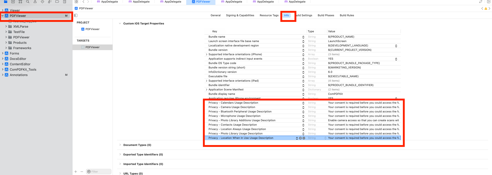

# ComPDFKit Flutter PDF Library

## Overview

[ComPDFKit PDF SDK](https://www.compdf.com) is a robust PDF library, which offers comprehensive functions for quickly viewing, annotating, editing, and signing PDFs. It is feature-rich and battle-tested, making PDF files process and manipulation easier and faster.

[ComPDFKit for Flutter](https://www.compdf.com/flutter) allows you to quickly add PDF functions to any Flutter application, elevating your Android and iOS apps to ensure seamless and efficient development.  It is available at [pub.dev](https://pub.dev/packages/compdfkit_flutter) and [GitHub.](https://github.com/ComPDFKit/compdfkit-pdf-sdk-flutter)

Watch the video here:
[](https://youtu.be/I0Rz11iVAbE)

## Related

* [ComPDFKit PDF Library for iOS](https://github.com/ComPDFKit/PDF-SDK-iOS)
* [ComPDFKit PDF Library for Android](https://github.com/ComPDFKit/PDF-SDK-Android)
* ComPDFKit PDF SDK - [React Native Library](https://www.compdf.com/react-native)
* [What Is Flutter and What Can It Do](https://www.compdf.com/blog/what-is-flutter)
* [How to Build a Flutter PDF Viewer?](https://www.compdf.com/blog/build-a-flutter-pdf-viewer)
* [How to Use ComPDFKit Flutter SDK to Build a New Application](https://www.compdf.com/blog/use-compdfkit-flutter-sdk-to-build-new-app)
* [ComPDFKit API](https://api.compdf.com/api/pricing) allows you to get 1000 files processing monthly now! Just [sign up](https://api.compdf.com/signup) for a free trial and enjoy comprehensive PDF functions.

## Key Features

- [**Viewer**](https://www.compdf.com/pdf-sdk/viewer) component offers Standard page display modes, Navigation, Text search & selection, Zoom in and out & Fit-page, Text reflow, and more.
- [**Annotations**](https://www.compdf.com/pdf-sdk/annotations) component offers Note, Link, Free Text, Line, Square, Circle, Highlight, Underline, Squiggly, Strikeout, Stamp, Ink, Sound, and more.
- [**Forms**](https://www.compdf.com/pdf-sdk/forms) component offers Push Button, Check Box, Radio Button, Text Field, Combo Box, List Box, Signature, and more.
- [**Document Editor**](https://www.compdf.com/pdf-sdk/document-editor) component offers Split, Extract, Merge, Delete, Insert, Crop, Move, Rotate, Replace, and Exchange pages, etc.
- [**Content Editor**](https://www.compdf.com/pdf-sdk/edit-pdf) component offers Copy, Resize, Change Colors, Text Alignment, Find and Replace, etc.
- [**Security**](https://www.compdf.com/pdf-sdk/security) component offers Encrypt and Decrypt PDFs, Watermark, etc.

If you want to know all the features that ComPDFKit SDK can offer, please see our [Feature List](https://www.compdf.com/pdf-sdk/features-list).

## Get Started

It's easy to embed [ComPDFKit Flutter SDK](https://www.compdf.com/guides/pdf-sdk/flutter/overview) into Flutter applications with a few lines of code. The following sections describe the optimal systems and environments to support, as well as quick integration steps. Let's take a few minutes to get started.

### Requirements

**Android**

Please install the following required packages:

* The [latest stable version of Flutter](https://docs.flutter.dev/get-started/install)
* The [latest stable version of Android Studio](https://developer.android.com/studio)
* The [Android NDK](https://developer.android.com/studio/projects/install-ndk)
* An [Android Virtual Device](https://developer.android.com/studio/run/managing-avds.html)

Operating Environment Requirements:

* A minSdkVersion of `21` or higher.
* A `compileSdkVersion` of `34` or higher.
* A `targetSdkVersion` of `34` or higher.
* Android ABI(s): x86, x86_64, armeabi-v7a, arm64-v8a.

**iOS**

Please install the following required packages:

* The [latest stable version of Flutter](https://docs.flutter.dev/get-started/install)
* The [latest stable version of Xcode](https://apps.apple.com/us/app/xcode/id497799835?mt=12)
* The [latest stable version of CocoaPods](https://github.com/CocoaPods/CocoaPods/releases). Follow the [CocoaPods installation guide](https://guides.cocoapods.org/using/getting-started.html#installation) to install it.

Operating Environment Requirements:

* The iOS 12.0 or higher.
* The Xcode 12.0 or newer for Objective-C or Swift.

### Integrate into a New Flutter APP

#### Android

1. Create a Flutter project called `example` with the `flutter` CLI:

```bash
flutter create --org com.compdfkit.flutter example
```

2. In the terminal app, change the location of the current working directory to your project:

```bash
cd example
```

3. open  `example/android/app/src/main/AndroidManifest.xml` , add `Internet Permission` and `Storage Permission`:

```diff
<manifest xmlns:android="http://schemas.android.com/apk/res/android"
    package="com.compdfkit.flutter.example">

+    <uses-permission android:name="android.permission.INTERNET"/>
  
    <!-- Required to read and write documents from device storage -->
+    <uses-permission android:name="android.permission.READ_EXTERNAL_STORAGE"/>
+    <uses-permission android:name="android.permission.WRITE_EXTERNAL_STORAGE"/>
  
    <!-- Optional settings -->
+    <uses-permission android:name="android.permission.MANAGE_EXTERNAL_STORAGE"/>


    <application
+      android:requestLegacyExternalStorage="true">
  
    </application>   
</manifest>
```

4. Open the app's Gradle build file, `android/app/build.gradle`:

```bash
open android/app/build.gradle
```

5. Modify the minimum SDK version, All this is done inside the `android` section:

```diff
 android {
     defaultConfig {
-        minSdkVersion flutter.minSdkVersion
+        minSdkVersion 21
         ...
     }
 }
```

6. Open the project’s main activity class, `android/app/src/main/java/com/example/compdfkit/flutter/example/MainActivity.java`, Change the base `Activity` to extend `FlutterFragmentActivity`:

```diff
- import io.flutter.embedding.android.FlutterActivity;
+ import io.flutter.embedding.android.FlutterFragmentActivity;

- public class MainActivity extends FlutterActivity {
+ public class MainActivity extends FlutterFragmentActivity {
}
```

Alternatively you can update the `AndroidManifest.xml` file to use `FlutterFragmentActivity` as the launcher activity:

```diff
<activity
-     android:name=".MainActivity" 
+     android:name="io.flutter.embedding.android.FlutterFragmentActivity"
      android:exported="true"
      android:hardwareAccelerated="true"
      android:launchMode="singleTop"
      android:theme="@style/LaunchTheme"
      android:windowSoftInputMode="adjustPan">
```

> **Note:** `FlutterFragmentActivity` is not an official part of the Flutter SDK. If you need to use `CPDFReaderWidget` in ComPDFKit for Flutter, you need to use this part of the code. You can skip this step if you don't need to use.

7. Add the ComPDFKit dependency in `pubspec.yaml`

```diff
 dependencies:
   flutter:
     sdk: flutter
+  compdfkit_flutter: ^2.4.3
```

8. Add the PDF documents you want to display in the project

* create a `pdf` directory

  ```bash
  mkdir pdfs
  ```
* Copy your example document into the newly created `pdfs` directory and name it `PDF_Document.pdf`

9. Specify the `assets` directory in `pubspec.yaml`

```diff
 flutter:
+  assets:
+    - pdfs/
```

10. From the terminal app, run the following command to get all the packages:

```bash
flutter pub get
```

#### iOS

1. Create a Flutter project called `example` with the `flutter` CLI:

```bash
flutter create --org com.compdfkit.flutter example
```

2. In the terminal app, change the location of the current working directory to your project:

```bash
cd example
```

3. Add the ComPDFKit dependency in `pubspec.yaml`

```diff
 dependencies:
   flutter:
     sdk: flutter
+  compdfkit_flutter: ^2.4.3
```

4. Open your project's Podfile in a text editor:

```bash
open ios/Podfile
```

**Note:** If SSL network requests fail to download the `ComPDFKit` library when you run `pod install`, you can see the processing method in [Troubleshooting](#Troubleshooting)).

6. Update the platform to iOS 12 and add the ComPDFKit Podspec:

```diff

- platform :ios, '9.0'
+ platform :ios, '12.0' 
 ...
 target 'Runner' do
   use_frameworks!
   use_modular_headers!`

   flutter_install_all_ios_pods File.dirname(File.realpath(__FILE__))
+  pod "ComPDFKit", podspec:'https://file.compdf.com/cocoapods/ios/compdfkit_pdf_sdk/2.4.3/ComPDFKit.podspec'
+  pod "ComPDFKit_Tools", podspec:'https://file.compdf.com/cocoapods/ios/compdfkit_pdf_sdk/2.4.3/ComPDFKit_Tools.podspec'
 end
```

7. Go to the `example/ios` folder and run the `pod install` command:

```bash
pod install
```

8. Add the PDF documents you want to display in the project

* create a `pdf` directory

  ```bash
  mkdir pdfs
  ```
* Copy your example document into the newly created `pdfs` directory and name it `PDF_Document.pdf`

9. Specify the `assets` directory in `pubspec.yaml`

```diff
 flutter:
+  assets:
+    - pdfs/
```

10. To protect user privacy, before accessing the sensitive privacy data, you need to find the "***Info\***" configuration in your iOS 10.0 or higher iOS project and configure the relevant privacy terms as shown in the following picture.



```objective-c
<key>NSCameraUsageDescription</key>
<string>Your consent is required before you could access the function.</string>

<key>NSMicrophoneUsageDescription</key>
<string>Your consent is required before you could access the function.</string>

<key>NSPhotoLibraryAddUsageDescription</key>
<string>Your consent is required before you could access the function.</string>

<key>NSPhotoLibraryUsageDescription</key>
<string>Your consent is required before you could access the function.</string>
  
<key>NSAppTransportSecurity</key>
	<dict>
		<key>NSAllowsArbitraryLoads</key>
		<true/>
	</dict>
```

11. From the terminal app, run the following command to get all the packages:

```bash
flutter pub get
```


#### Apply the License Key

ComPDFKit PDF SDK is a commercial SDK, which requires a license to grant developer permission to release their apps. Each license is only valid for one `bundle ID` or `applicationId` in development mode. Other flexible licensing options are also supported, please contact [our marketing team](mailto:support@compdf.com) to know more.

To initialize ComPDFKit using a license key, call either of the following before using any other ComPDFKit APIs or features:

* **Online license:**

```dart
ComPDFKit.initialize(androidOnlineLicense : 'your compdfkit key', iosOnlineLicense : 'your compdfkit key');
```

* **Offline license:**

```dart
ComPDFKit.init('your compdfkit key');
```

* **Initialize Using License XML File**:

```dart
// Android
// Copy the license_key_flutter.xml file into the assets directory of your Android project:
ComPDFKit.initWithPath('assets://license_key_flutter.xml');

// iOS
// Copy the license_key_flutter.xml file into your iOS project directory (or a readable location):
ComPDFKit.initWithPath('license_key_flutter.xml');

// Include the license in Flutter assets and copy to device storage
// Add `license_key_flutter.xml` to your Flutter project’s assets directory;
File licenseFile = await extractAsset(context, 'assets/license_key_flutter.xml');
ComPDFKit.initWithPath(licenseFile.path);
```

**Example:**

```dart
import 'dart:io';

import 'package:compdfkit_flutter/compdfkit.dart';
import 'package:compdfkit_flutter/cpdf_configuration.dart';

import 'package:flutter/material.dart';

const String _documentPath = 'pdfs/PDF_Document.pdf';

void main() {
  runApp(const MyApp());
}

class MyApp extends StatefulWidget {
  const MyApp({super.key});

  @override
  State<MyApp> createState() => _MyAppState();
}

class _MyAppState extends State<MyApp> {

  @override
  void initState() {
    super.initState();
    _init();
  }

  void _init() async {
    File licenseFile = await extractAsset(context, 'assets/license_key_flutter.xml');
    ComPDFKit.initWithPath(licenseFile.path);
  }

  @override
  Widget build(BuildContext context) {
    return MaterialApp();
  }
}
```

#### Usage

There are 2 different ways to use ComPDFKit Flutter API:

* Present a document via a plugin.
* Show a ComPDFKit document view via a Widget.

##### Usage Plugin

Open `lib/main.dart`,replace the entire file with the following:

```dart
import 'dart:io';

import 'package:compdfkit_flutter/compdfkit.dart';
import 'package:compdfkit_flutter/configuration/cpdf_configuration.dart';

import 'package:flutter/material.dart';

const String _documentPath = 'pdfs/PDF_Document.pdf';

void main() {
  runApp(const MyApp());
}

class MyApp extends StatefulWidget {
  const MyApp({super.key});

  @override
  State<MyApp> createState() => _MyAppState();
}

class _MyAppState extends State<MyApp> {
  @override
  void initState() {
    super.initState();
    _init();
  }

  void _init() async {
    /// If you are using an offline certified license, please use init() method
    ComPDFKit.init('your compdfkit key');
  }

  @override
  Widget build(BuildContext context) {
    return MaterialApp(
      home: Scaffold(
          body: SafeArea(
              child: Center(
                child: ElevatedButton(
                    onPressed: () async {
                      showDocument(context);
                    },
                    child: const Text(
                      'Open Document',
                      style: TextStyle(color: Colors.white),
                    )),
              ))),
    );
  }

  void showDocument(BuildContext context) async {
    final bytes = await DefaultAssetBundle.of(context).load(_documentPath);
    final list = bytes.buffer.asUint8List();
    final tempDir = await ComPDFKit.getTemporaryDirectory();
    var pdfsDir = Directory('${tempDir.path}/pdfs');
    pdfsDir.createSync(recursive: true);

    final tempDocumentPath = '${tempDir.path}/$_documentPath';
    final file = File(tempDocumentPath);
    if (!file.existsSync()) {
      file.create(recursive: true);
      file.writeAsBytesSync(list);
    }
    var configuration = CPDFConfiguration();
    // Present a document via a plugin.
    ComPDFKit.openDocument(tempDocumentPath,
        password: '', configuration: configuration);
  }
}
```

##### Usage Widget

Open `lib/main.dart`,replace the entire file with the following:

```dart
import 'dart:io';

import 'package:compdfkit_flutter/compdfkit.dart';
import 'package:compdfkit_flutter/configuration/cpdf_configuration.dart';
import 'package:compdfkit_flutter/widgets/cpdf_reader_widget.dart';

import 'package:flutter/material.dart';

const String _documentPath = 'pdfs/PDF_Document.pdf';

void main() {
  runApp(const MyApp());
}

class MyApp extends StatefulWidget {
  const MyApp({super.key});

  @override
  State<MyApp> createState() => _MyAppState();
}

class _MyAppState extends State<MyApp> {
  String? _document;

  @override
  void initState() {
    super.initState();
    _init();
    _getDocumentPath(context).then((value) {
      setState(() {
        _document = value;
      });
    });
  }

  void _init() async {
    /// If you are using an offline certified license, please use init() method
    ComPDFKit.init('your compdfkit key');
  }

  @override
  Widget build(BuildContext context) {
    return MaterialApp(
      home: Scaffold(
        resizeToAvoidBottomInset: false,
        appBar: AppBar(
          title: const Text('Dark Theme Example'),
        ),
        body: _document == null
        ? Container()
        : CPDFReaderWidget(
          document: _document!,
          configuration: CPDFConfiguration(),
          onCreated: (_create) => {})));
  }

  Future<String> _getDocumentPath(BuildContext context) async {
    final bytes = await DefaultAssetBundle.of(context).load(_documentPath);
    final list = bytes.buffer.asUint8List();
    final tempDir = await ComPDFKit.getTemporaryDirectory();
    var pdfsDir = Directory('${tempDir.path}/pdfs');
    pdfsDir.createSync(recursive: true);

    final tempDocumentPath = '${tempDir.path}/$_documentPath';
    final file = File(tempDocumentPath);
    if (!file.existsSync()) {
      file.create(recursive: true);
      file.writeAsBytesSync(list);
    }
    return tempDocumentPath;
  }
}
```

Start your Android emulator, or connect a device, Run the app with:

```bash
flutter run
```


#### Troubleshooting

1.SSL network request to download 'ComPDFKit' library failed when cocopods downloaded iOS third-party library

If SSL network requests fail to download the `ComPDFKit` library when you run `pod install`, replace the third-party platform download address link of the ComPDFKit library and execute `pod install`

````diff
require_relative '../node_modules/react-native/scripts/react_native_pods'
require_relative '../node_modules/@react-native-community/cli-platform-ios/native_modules'

- platform :ios, '10.0'
+ platform :ios, '12.0'
install! 'cocoapods', :deterministic_uuids => false

target 'PDFView_RN' do
  config = use_native_modules!

  # Flags change depending on the env values.
  flags = get_default_flags()

  use_react_native!(
    :path => config[:reactNativePath],
    # to enable hermes on iOS, change `false` to `true` and then install pods
    :hermes_enabled => flags[:hermes_enabled],
    :fabric_enabled => flags[:fabric_enabled],
    # An absolute path to your application root.
    :app_path => "#{Pod::Config.instance.installation_root}/.."
  )

  target 'PDFView_RNTests' do
    inherit! :complete
    # Pods for testing
  end

+  pod 'ComPDFKit', :git => 'https://github.com/ComPDFKit/compdfkit-pdf-sdk-ios-swift.git', :tag => '2.4.3'
+  pod 'ComPDFKit_Tools', :git => 'https://github.com/ComPDFKit/compdfkit-pdf-sdk-ios-swift.git', :tag => '2.4.3'

  # Enables Flipper.
  #
  # Note that if you have use_frameworks! enabled, Flipper will not work and
  # you should disable the next line.
  use_flipper!()

  post_install do |installer|
    react_native_post_install(installer)
    __apply_Xcode_12_5_M1_post_install_workaround(installer)
  end
end
````

## UI Customization

In the **1.12.0** version, we have expanded the options that can be defined in the [CPDFConfiguration](./lib/configuration/cpdf_configuration.dart) class. When using the `ComPDFKit.openDocument` method to open a PDF View or use `CPDFReaderWidget`, you can define this object to meet your product needs. We will continue to enrich the configuration options in the future to further enhance the flexibility of the product. The following are some examples of commonly used configuration options:

1. Set the initial display mode and the list of available modes. The following code shows enabling only the viewer mode and annotations mode:

```dart
var configuration = CPDFConfiguration(modeConfig: const ModeConfig(
  initialViewMode: CPreviewMode.viewer,
  availableViewModes: [
    CPreviewMode.viewer,
    CPreviewMode.annotations
  ]
));
ComPDFKit.openDocument(documentPath, password: '', configuration: configuration);
```

2. Set the list of enabled annotation types and default annotation attribute values. For example, enable only highlight annotations and set the color and transparency for highlight annotations:

```dart
var configuration = CPDFConfiguration(
  annotationsConfig: const CPDFAnnotationsConfig(
    availableTypes: [CPDFAnnotationType.highlight],
    initAttribute: CPDFAnnotationAttribute(
      highlight: CPDFAnnotAttr.highlight(color: Colors.blue, alpha: 255))));

ComPDFKit.openDocument(documentPath, password: '', configuration: configuration);
```

3. Set the display mode and page flipping direction:

```dart
var configuration = CPDFConfiguration(
  readerViewConfig: const ReaderViewConfig(
    displayMode: CPDFDisplayMode.doublePage,
    verticalMode: false
  )
);

ComPDFKit.openDocument(documentPath, password: '', configuration: configuration);
```

> Note: For more information, please refer to the options defined in the [CONFIGURATION.md](./CONFIGURATION.md) class

## Example APP

To see [ComPDFKit for Flutter](https://www.compdf.com/contact-sales) in action, check out our [Flutter example app](example/) and [API reference](https://pub.dev/documentation/compdfkit_flutter/latest/compdfkit/compdfkit-library.html)

Showing a PDF document inside your Flutter app is as simple as this:

```dart
/// First. Please replace it with your ComPDFKit license

/// online authentication
ComPDFKit.initialize(androidOnlineLicense : 'your compdfkit key', iosOnlineLicense : 'your compdfkit key');

/// offline authentication
ComPDFKit.init('your compdfkit key')

/// open pdf document
ComPDFKit.openDocument(tempDocumentPath, password: '', configuration:  CPDFConfiguration());

/// Here’s how you can open a PDF document using CPDFReaderWidget:
Scaffold(
        resizeToAvoidBottomInset: false,
        appBar: AppBar(title: const Text('CPDFReaderWidget Example'),),
        body: CPDFReaderWidget(
          document: widget.documentPath,
          configuration: CPDFConfiguration()
        ));
```

## Support

[ComPDFKit](https://www.compdf.com/) has a professional R&D team that produces comprehensive technical documentation and guides to help developers. Also, you can get an immediate response when reporting your problems to our support team.

- For detailed information, please visit our [Guides](https://www.compdf.com/guides/pdf-sdk/flutter/overview) page.
- Stay updated with the latest improvements through our [Changelog](https://www.compdf.com/pdf-sdk/changelog-flutter).
- For technical assistance, please reach out to our [Technical Support](https://www.compdf.com/support).
- To get more details and an accurate quote, please contact our [Sales Team](https://compdf.com/contact-us).

## License

ComPDFKit PDF SDK supports flexible licensing options, please contact [our sales team](mailto:support@compdf.com) to know more. Each license is only valid for one application ID in development mode. However, any documents, sample code, or source code distribution from the released package of ComPDFKit PDF SDK to any third party is prohibited.

## Note

We are glad to announce that you can register a ComPDFKit API account for a [free trial](https://api.compdf.com/api/pricing) to process 1000 documents per month for free.

Thanks,
The ComPDFKit Team
