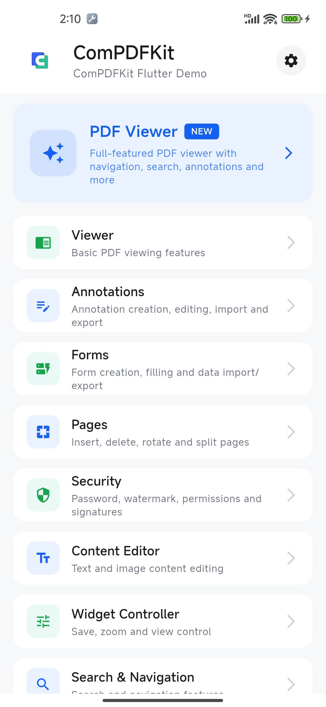
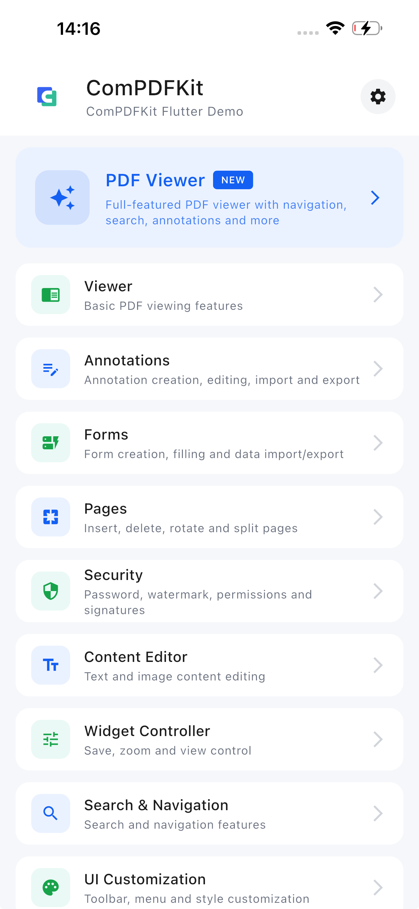

# ComPDFKit Flutter Example

A feature-rich sample app demonstrating PDF viewing, annotation, forms, page editing, content editing, search, security, and UI customization with `compdfkit_flutter`.


<p align="center">
  <b>Android</b>
  &nbsp;&nbsp;&nbsp;&nbsp;&nbsp;&nbsp;&nbsp;&nbsp;&nbsp;&nbsp;&nbsp;&nbsp;&nbsp;&nbsp;&nbsp;&nbsp;&nbsp;&nbsp;&nbsp;&nbsp;&nbsp;&nbsp;&nbsp;&nbsp;&nbsp;&nbsp;&nbsp;&nbsp;&nbsp;&nbsp;&nbsp;&nbsp;&nbsp;&nbsp;&nbsp;&nbsp;&nbsp;&nbsp;&nbsp;&nbsp;&nbsp;&nbsp;&nbsp;&nbsp;&nbsp;&nbsp;&nbsp;&nbsp;&nbsp;&nbsp;&nbsp;&nbsp;&nbsp;&nbsp;&nbsp;&nbsp;&nbsp;&nbsp;&nbsp;&nbsp;&nbsp;&nbsp;&nbsp;&nbsp;&nbsp;&nbsp;
  <b>iOS</b>
</p>
<p align="center">
  
  &nbsp;&nbsp;&nbsp;&nbsp;
  
</p>


---

## Quick Start

```bash
cd example
flutter pub get            # Install dependencies
flutter run                # Run on device/emulator
```

### License Setup

1. Obtain a license from [ComPDFKit](https://www.compdf.com).
2. Save it to `assets/license_key_flutter.xml`.
3. The app loads this file automatically via `AppAssets.licenseKeyFlutter`.

---

## Feature Index

| Category | Description | Examples |
|----------|-------------|----------|
| **Viewer** | PDF open & display | Basic Viewer, Open External File, Modal Viewer, Dark Theme |
| **Annotations** | Create, edit, delete, import/export | Add/Edit/Delete Annotation, XFDF, Custom Stamps, API Mode |
| **Forms** | Form fields & data | Create/Fill Fields, Default Style, Import/Export Data, API Mode |
| **Pages** | Page operations | Insert, Delete, Rotate, Move, Split, Thumbnails |
| **Security** | Passwords, watermarks, signatures | Set/Remove Password, Watermark, Permissions, Digital Signature |
| **Content Editor** | Text & image editing | Text/Image Editing, Edit Mode, Undo/Redo |
| **Widget Controller** | Viewer controls | Save, Zoom, Display Settings, Thumbnails, Snip/Preview Mode |
| **Search & Navigation** | Find & navigate | Text Search, Outline, Bookmarks, Page Navigation |
| **UI Customization** | Toolbar & menu styling | Toolbar, Context Menu, UI Style, Event Listeners |
| **Document API** | Headless API usage | Open Document, Info, XFDF, Bookmarks, Render, Search |

> See `lib/examples/README.md` for detailed sample code references.

---

## Project Structure

```
lib/
├─ main.dart                  # Entry point
├─ constants/                 # AppAssets & other constants
├─ cpdf_reader_page.dart      # Shared reader host
├─ app/                       # Home, Category, Settings pages
├─ examples/                  # Feature samples by category
├─ features/                  # Reusable PDF modules
├─ widgets/                   # Common UI components
├─ utils/, model/, theme/     # Helpers, models, theming
```

---

## Requirements

### Android

- Android Studio + NDK
- `minSdkVersion` >= 21, `compileSdkVersion` >= 33

### iOS

- Xcode 12+ & CocoaPods
- iOS 12.0+

---

## Build & Test

```bash
# Android APK
flutter build apk

# iOS (run CocoaPods first)
cd ios && pod install && cd ..
flutter build ios

# Analysis & tests
flutter analyze
flutter test
flutter test integration_test/
```

---

## Troubleshooting

| Issue | Solution |
|-------|----------|
| CocoaPods error | Run `pod install` in `ios/` |
| Android NDK missing | Install NDK via SDK Manager |
| License not applied | Verify `assets/license_key_flutter.xml` exists and is listed in `pubspec.yaml` |

---

## References

- [Flutter SDK Guide](https://www.compdf.com/guides/pdf-sdk/flutter/overview)
- [GitHub Repository](https://github.com/ComPDFKit/compdfkit-pdf-sdk-flutter)
